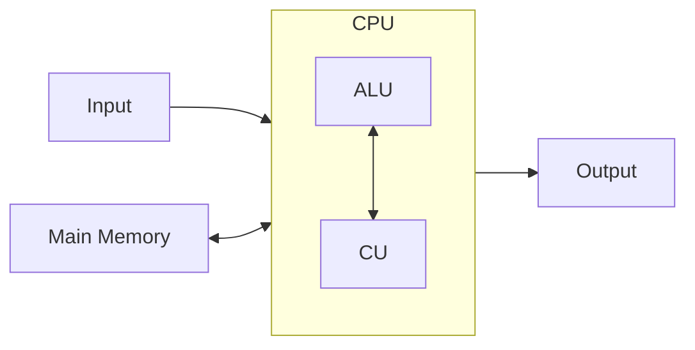

## Things you need to know 
1. What is Software
2. What is Firmware
3. What is Hardware
4. Von-Neumann Architecture
5. What is a System Bus
6. What is a CPU
7. What is Main Memory (Primary Memory)
8. What are I/O Modules
9. Fetch, Decode, Execute… Cycle
10. CPU Interrupts
11. CLI/TUI/GUI

## Von-Neumann Architecture

_Note: this is a simplified example and explaination_

It’s a general design of a programable computer! Remember the first computers were build to do a single task! This meant that the instructions was baked into the hardware of the computer. Each computer was only able to do the task it was designed for and could not be reprogrammed.

The Von-Neumann Architecture specifies a computer design that has:
1. **Control Unit**: 
	- Reads and executes the code stored in memory.
	- Controls the other components in the architecture (ALU, I/O and Memory)
2. **Arithmetic Logic Unit**:
	- Carries out all the arithmetic operations (addition, XOR, divide…)
3. **Main Memory**:
	- Stores the programme code
	- Stores the data used by the programme
4. **Input/Output**:
	- Input
	- Output
	- :)

This design, with the Control Unit, allows the computer to fetch and execute programme specific instructions! Making able to be programmable!!

Additionally, with the programme and data stored in the same place, it allowed for the programme to change it’s own code during execution. However, this turned out to be a bad idea, due to bottle necks and being a bad way to design code.
