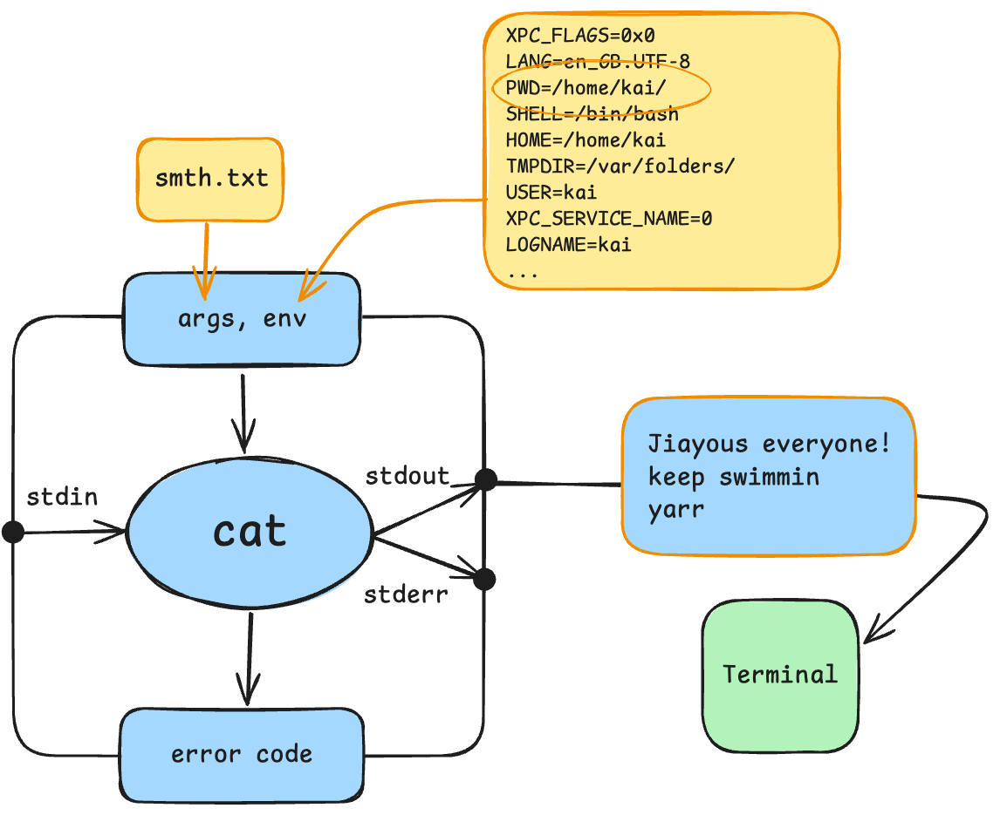
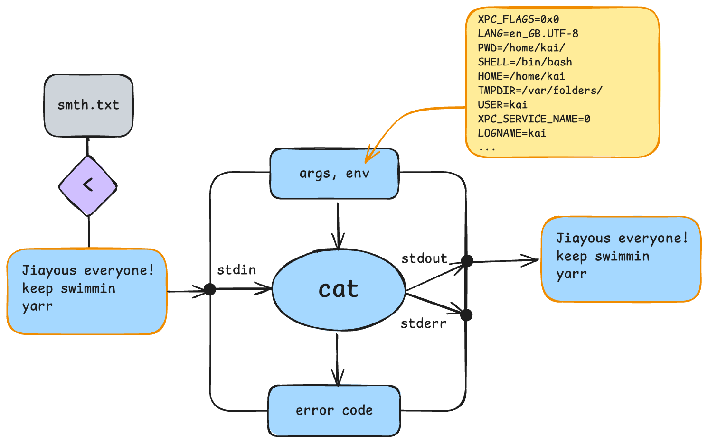
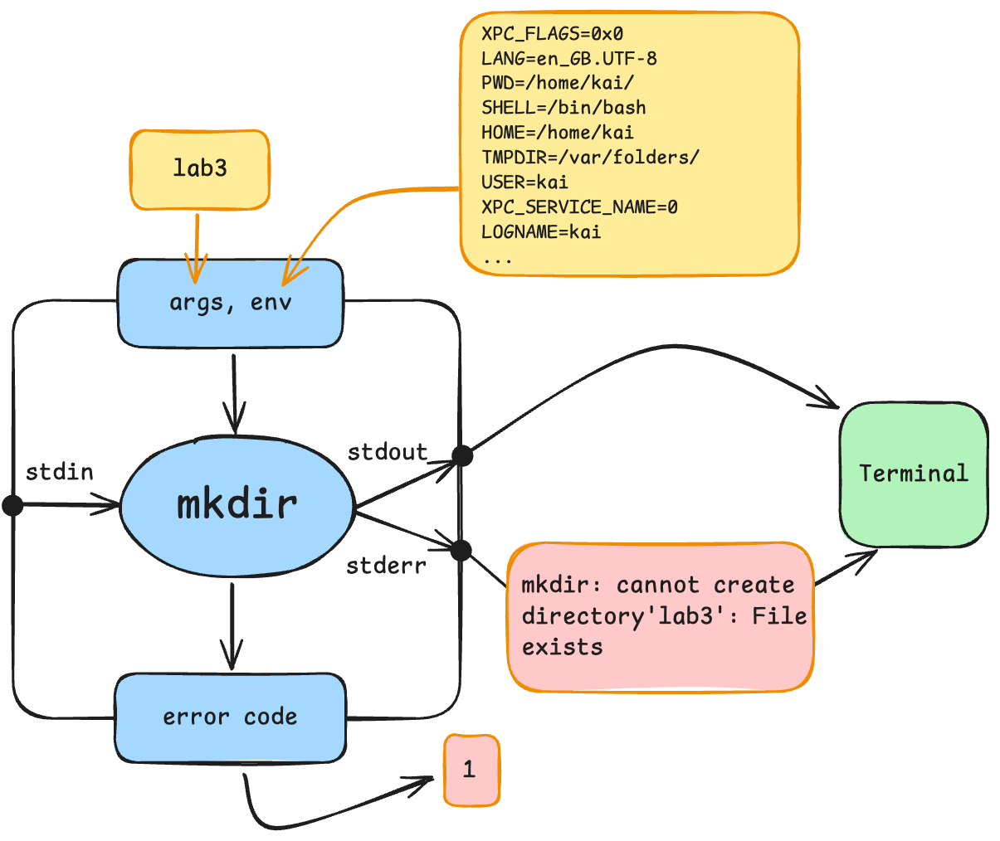
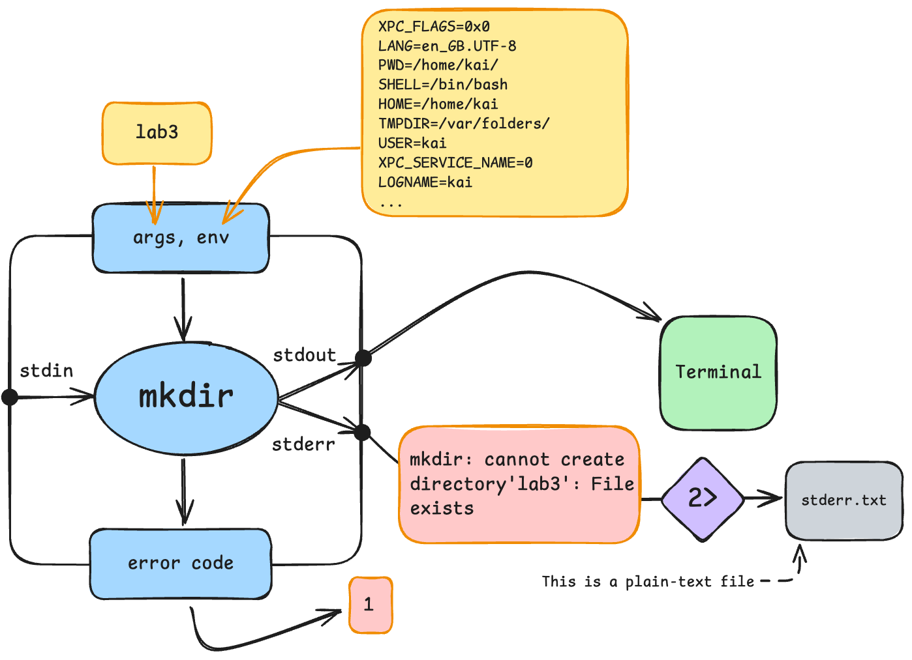

## ‘cat smth.txt’ vs ‘cat < smth.txt’
Okay, I’m going to explain all of this with examples. So, before we start, let’s define a few things to make sure we are on the same page. Our ‘environment variables’ so to speak…

The examples will show me using the ‘cat’ command on a file named ‘smth.txt’ which exists in my user’s home directory!
- My user’s home directory → ‘/home/kai’
- Path of ‘smth.txt’ → ‘/home/kai/smth.txt’
- My working directory is my home directory
	- i.e. the ‘cat’ command will be ran from ‘/home/kai/’

Alright, bellow are the contents of smth.txt:
``` txt
Jiayous everyone!
keep swimmin
yarr
```

### ‘cat smth.txt’
```bash
kai@kai:~$ cat smth.txt
```
Aite, ya’ll should b familiar w this! Lets see how it looks like using prof’s diagram of a process:

So, when you run cat in this way, you’re passing the characters **“smth.txt”** as an *argument* into cat. The cat process, then has to ‘manually’ open smth.txt, read its contents, then pass it to stdout!

### ‘cat < smth.txt’
```bash
kai@kai:~$ cat < smth.txt
```
How is this different? In the earlier example, “smth.txt” was an *argument*. In this case it is not, the process arguments are empty. Instead, the *contents* of “smth.txt” are passed into stdin. Let’s take a look:

This happens because of ‘<’. 

I’m sure you’re all familiar by now with ‘>’. This right arrow is used to *redirect output*. Its name says it all, it redirects stdout and writes it into a specified file!

**‘<’** is much the same. But it’s used to *redirect input*. So, like the reverse of writing to a file, it reads from the given file, and passes it on to the stdin of the process it’s pointed to!

## Review of Task 2 (parts 5 & 6)
```
 1. kai@kai:~$ mkdir lab3
 2. kai@kai:~$ echo $?
 3. 0
 4. kai@kai:~$ mkdir lab3 > lab3/stdout.txt
 5. mkdir: cannot create directory 'lab3': File exists
 6. kai@kai:~$ echo $?
 7. 1
 8. kai@kai:~$ mkdir lab3 2> lab3/stderr.txt
 9. kai@kai:~$ echo $?
10. 1
```
*(I added line numbers for clarity)*
### Question 1: Why do both the commands in line 5 & 8 both return an error code of 1?
Okay, to answer this, let’s take a look at what’s going on when we simply run the command `mkdir lab3` when there’s already a directory ‘lab3’.

In both lines 5 & 8, we run a command which executes *the* mkdir *programme*. This then starts *an* mkdir *process*, which encounters an error (lab3 already exists) and terminates with the error code/exit status of 1.

### Question 2: Why does the command in line 5 print an error message while the command in line 8 doesn’t?
Here’s a look at what’s going on in line 8:

In the case of the command in line 8. That command used ‘2>’ which redirects **stderr** (and only stderr) into a text file. That’s why the error message isn’t printed into the terminal. 

Whereas, the command in line 5 used ‘>’, which only redirects **stdout** into a text file, and thus, stderr was outputted into the terminal! 
## Behaviour of cat vs sort when used alone
#todo

## Ctrl-c vs Ctrl-d
#todo
