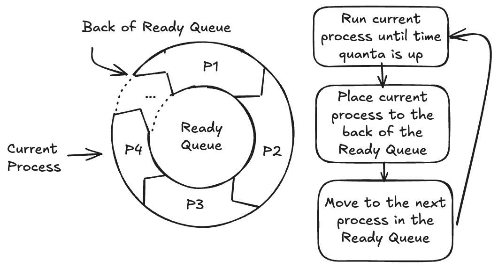
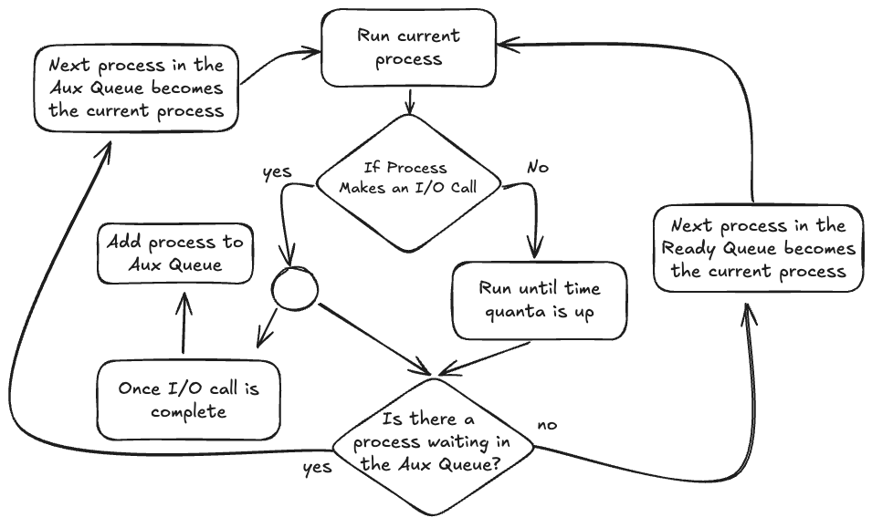
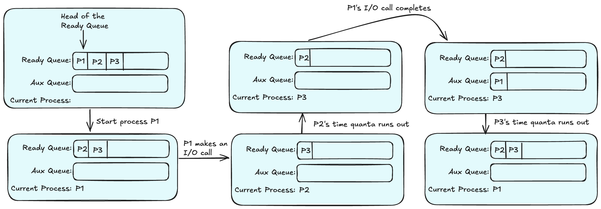

_Disclaimer: Anything in the slides can be tested, But I THINK these u can kinda ignore, just know they exist…_
## Structure of a Program
A program file, although stored as one large binary file, has multiple internal segments with different responsibilities.

They are : Headers, Text, RO-Data, Data and BSS*
### Block Starting Symbol
Read the slides if you wish to know what the rest are, here i’ll just cover **BSS**.

The BSS segment in a program file, exists as part of the Header. 
If I have a program with many variables initialised to 0, it would be a waste of space to store all those 0s inside the Data segment. So instead, you just store the number of 0s needed in the BSS segment!
Think of it has storing how many 0s are needed for all the 0 initialised variables.

[If you would like to know more.](./BSS-in-depth.md)
## Structure of a Process
When a program is executed and a process is created. The operating system copies the Headers, Text, RO-Data and Data into RAM. Additionally, it assigns some amount of RAM (as defined in the Header) as the program’s Stack segment, and also assigns some amount of RAM (also defined in the Header) as the BSS segment. Slides 7-8 explains this better LOL
## Program vs Process
Process is an instance of a Program.
## Threads
js refer to slide 18 LOL
## Process Scheduling
### Round Robin vs Virtual Round Robin
###### Round Robin:
Round Robin only has 1 Queue

###### Virtual Round Robin:
Virtual Round Robin has 2 Queues, Ready and Auxiliary.

